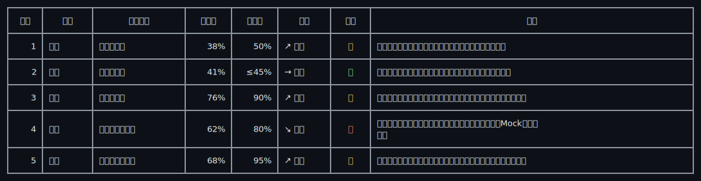

# hermes-skill-markdown-cli-table-rendering

Hermes skill for rendering Markdown pipe tables as aligned CLI box tables.

## What it solves

Markdown tables often look misaligned in terminal output when they contain:

- Chinese full-width characters
- emoji and variation selectors
- numeric columns
- long text cells that need wrapping

This skill teaches Hermes to render Markdown tables as Unicode box-drawing tables in CLI contexts.

## Install as a Hermes skill

Clone this repository into your Hermes skills directory using the skill name as the target folder:

```bash
mkdir -p ~/.hermes/skills/productivity
git clone https://github.com/ZeRuTian/hermes-skill-markdown-cli-table-rendering.git \
  ~/.hermes/skills/productivity/markdown-cli-table-rendering
```

If it is already installed, update it with:

```bash
git -C ~/.hermes/skills/productivity/markdown-cli-table-rendering pull
```

Then start a new Hermes session so the skill list is reloaded.

## Use the standalone renderer

After installation:

```bash
SKILL=~/.hermes/skills/productivity/markdown-cli-table-rendering
python3 "$SKILL/scripts/render_markdown_table.py" < table.md
```

From a local clone of this repository:

```bash
python3 scripts/render_markdown_table.py < table.md
```

## Verify installation

```bash
SKILL=~/.hermes/skills/productivity/markdown-cli-table-rendering
python3 "$SKILL/scripts/render_markdown_table.py" \
  < "$SKILL/examples/emoji-cli-sample.md"
```

You should see a Unicode box table with aligned columns.

## GitHub README display note

GitHub web code blocks may render emoji through a browser fallback font, so an emoji table can look misaligned on GitHub even when its terminal cell widths are correct.

For that reason, the README preview below uses a text-presentation arrow (`↗︎`) instead of an emoji-presentation arrow (`↗️`). The renderer still supports emoji in real CLI / TUI output; use `examples/emoji-cli-sample.md` to test that locally.

## Browser-safe preview

Input Markdown:

```markdown
| 序号 | 模块 | 指标名称 | 当前值 | 目标值 | 趋势 | 风险 | 说明 |
|---:|---|---|---:|---:|---|:---:|---|
| 1 | 进度 | 总体完成率 | 38% | 50% | ↗︎ 上升 | 中 | 仍低于计划，后续需要压缩评审、联调和业务确认周期。 |
| 2 | 成本 | 预算使用率 | 41% | ≤45% | → 平稳 | 低 | 当前暂无超支风险，但采购审批和外包人天需要持续跟踪。 |
| 3 | 质量 | 缺陷关闭率 | 76% | 90% | ↗︎ 上升 | 中 | 需要把阻塞缺陷单独拉清单，明确责任人、修复版本和回归时间。 |
| 4 | 接口 | 外部接口完成率 | 62% | 80% | ↘︎ 下降 | 高 | 对方接口文档仍不完整，建议每日同步字段口径并保留Mock兜底方案。 |
| 5 | 培训 | 关键用户覆盖率 | 68% | 95% | ↗︎ 上升 | 中 | 培训材料需根据最终页面截图更新，并补充常见问题与操作边界。 |
```

Output preview on GitHub:



The raw terminal text for this preview is saved in `examples/browser-safe-sample-output.txt`.

## Files

- `SKILL.md` — Hermes skill definition and workflow
- `scripts/render_markdown_table.py` — standalone renderer for Markdown pipe tables
- `assets/complex-browser-safe-preview.svg` — GitHub-safe visual preview that avoids browser code-block width issues
- `examples/browser-safe-sample.md` — README-safe text-presentation arrow example
- `examples/browser-safe-sample-output.txt` — generated browser-safe output
- `examples/emoji-cli-sample.md` — emoji test input for CLI / TUI
- `examples/emoji-cli-sample-output.txt` — generated emoji CLI output
- `references/test-prompts.json` — test prompts for evaluating behavior
- `references/darwin-results.tsv` — Darwin optimization scoring record

## License

MIT
